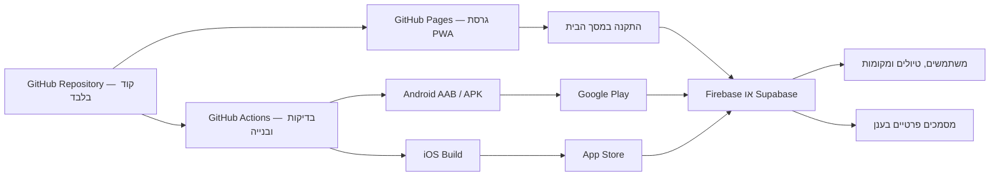

# TravelMate — מסלול מ־GitHub לאפליקציית טלפון

עודכן: 17 ביולי 2026

## החלטה מומלצת

להשתמש ב־GitHub עבור:

- שמירת קוד המקור והיסטוריית השינויים.
- פרסום גרסת Web/PWA באמצעות GitHub Pages.
- בדיקות ובנייה אוטומטית באמצעות GitHub Actions.
- שמירת קובצי התקנה וגרסאות בדיקה באמצעות GitHub Releases.

לא להשתמש ב־GitHub עבור:

- מסמכים פרטיים שהמשתמשים מעלים, כגון דרכונים, פוליסות וכרטיסי טיסה.
- מסד נתונים חי של חשבונות, טיולים, מיקומים ופעילויות.
- שמירת סיסמאות, מפתחות API או אסימוני התחברות בתוך הקוד.

הארכיטקטורה המומלצת היא GitHub לקוד ולבנייה, שירות Backend ייעודי לנתונים ולקבצים, ו־Capacitor ליצירת אפליקציות Android ו־iOS.



## למה לא לשמור מסמכי משתמשים בתוך GitHub

Git הוא מערכת לניהול גרסאות קוד, ולא מערכת אחסון למסמכים שמועלים ומשתנים בתדירות גבוהה. כל שינוי יוצר היסטוריה, מחיקת קובץ אינה בהכרח מוחקת אותו מהיסטוריית המאגר, וגישה ממכשיר נייד הייתה דורשת אסימון GitHub שאסור להטמיע באפליקציה.

בנוסף:

- קובץ שמועלה דרך ממשק GitHub מוגבל ל־25MiB.
- GitHub חוסם קובץ יחיד הגדול מ־100MiB ללא Git LFS.
- GitHub ממליץ לשמור קבצים שנוצרים על ידי האפליקציה ב־Object Storage, מחוץ ל־Git.
- מאגר ציבורי חושף את כל הקבצים לכל אדם באינטרנט.
- GitHub Pages בחשבון Free מיועד בעיקר למאגרים ציבוריים, ולכן אין להשתמש בו להצגת מידע אישי או רגיש.

## מבנה המערכת

### 1. GitHub Repository

המאגר יכיל:

```text
TravelMate/
├── assets/
├── trip/
├── docs/
├── mobile/
├── index.html
├── manifest.webmanifest
├── service-worker.js
├── capacitor.config.ts
├── package.json
└── .github/
    └── workflows/
```

אין להעלות למאגר:

```text
.env
.env.local
*.keystore
*.jks
GoogleService-Info.plist
google-services.json
מסמכי משתמשים
מפתחות חתימה
מפתחות API פרטיים
```

פרטי התחברות הדרושים לתהליך הבנייה יישמרו ב־GitHub Actions Secrets ולא בקבצים רגילים.

### 2. GitHub Pages ו־PWA

GitHub Pages יארח את גרסת האינטרנט של TravelMate. כדי שהאתר יופיע כאייקון בטלפון יש להוסיף:

- `manifest.webmanifest` עם שם, צבעים, `start_url` ואייקונים.
- אייקונים בגדלים 192×192 ו־512×512.
- `service-worker.js` לשמירת קובצי הממשק ועבודה ללא אינטרנט.
- חיבור HTTPS, שמתקבל אוטומטית בכתובת `github.io`.
- מסך התקנה והסבר למשתמשי Android ו־iPhone.

כתובת לדוגמה:

```text
https://USERNAME.github.io/travelmate/
```

גרסה זו תאפשר לבדוק את המוצר בטלפונים אמיתיים לפני הכניסה לחנויות.

### 3. מסד נתונים ואחסון מסמכים

ה־IndexedDB הקיים מתאים לשימוש מקומי ואופליין, אך אינו מסנכרן בין מכשירים. לגרסה אמיתית נדרש Backend כגון Firebase או Supabase.

ה־Backend צריך לספק:

- התחברות משתמשים.
- טבלת טיולים.
- ימים ופעילויות בכל טיול.
- מקומות שמורים, קואורדינטות ותאריך השיבוץ.
- תקציב והוצאות.
- Storage פרטי למסמכים.
- הרשאות שמבטיחות שכל משתמש רואה רק את הקבצים שלו.
- סנכרון שינויים כאשר החיבור לאינטרנט חוזר.

מבנה נתונים אפשרי:

```text
users/{userId}
trips/{tripId}
trips/{tripId}/days/{date}
trips/{tripId}/places/{placeId}
trips/{tripId}/expenses/{expenseId}
trips/{tripId}/documents/{documentId}
storage/users/{userId}/trips/{tripId}/{documentId}
```

לכל מסמך יישמרו במסד הנתונים רק Metadata וכתובת הקובץ. הקובץ עצמו יישמר ב־Cloud Storage פרטי.

### 4. אפליקציית Android ו־iOS באמצעות Capacitor

Capacitor יעטוף את אפליקציית ה־Web הקיימת במעטפת Native. כך ניתן לשמור את רוב HTML, CSS ו־JavaScript שכבר נבנו ולהוסיף יכולות טלפון:

- GPS והרשאות מיקום.
- מצלמה וסריקת מסמכים.
- בחירת קבצים מהמכשיר.
- התראות Push.
- פתיחת Google Maps או Apple Maps.
- שיתוף קישורים ומסלולים.
- אחסון מאובטח של Session.
- זיהוי מצב Offline.
- קישורים שפותחים טיול מסוים באפליקציה.

פקודות הבנייה העתידיות יהיו בקירוב:

```bash
npm install
npx cap add android
npx cap add ios
npx cap sync
npx cap open android
npx cap open ios
```

Android ייבנה ב־Android Studio. עבור iOS נדרשים macOS, Xcode וחשבון Apple Developer.

## שלבי ביצוע

### שלב 0 — הכנת המאגר

- יצירת מאגר בשם `travelmate`.
- החלטה אם הקוד יכול להיות ציבורי.
- העלאת הקוד ללא מידע אישי ומפתחות.
- הוספת `README.md`, רישיון לפי הצורך ו־`.gitignore` מלא.
- הפעלת הגנת ענף ראשי וסריקת Secrets.

תוצר: קוד הפרויקט מנוהל ומגובה ב־GitHub.

### שלב 1 — פרסום PWA

- הוספת Manifest, אייקונים ו־Service Worker.
- התאמת כל הנתיבים לעבודה תחת `/travelmate/`.
- הפעלת GitHub Pages.
- בדיקה ב־Android וב־iPhone.
- הוספת כפתור “התקנת TravelMate”.

תוצר: אפליקציה שניתן להצמיד למסך הבית דרך הדפדפן.

### שלב 2 — משתמשים וענן

- בחירת Firebase או Supabase.
- הוספת הרשמה, התחברות ויציאה.
- העברת טיולים מ־LocalStorage למסד הנתונים.
- העברת מסמכים מ־IndexedDB ל־Cloud Storage.
- הצפנת תקשורת והרשאות לפי משתמש.
- שמירה מקומית להמשך עבודה ללא אינטרנט.

תוצר: אותו טיול זמין בטלפון ובמחשב.

### שלב 3 — גרסת Android

- הוספת Capacitor.
- יצירת פרויקט Android.
- חיבור GPS, מצלמה, קבצים והתראות.
- הגדרת שם חבילה, לדוגמה `com.travelmate.app`.
- יצירת אייקון, Splash Screen ומדיניות פרטיות.
- בדיקות על מכשירי Android אמיתיים.
- בניית קובץ AAB והעלאה למסלול בדיקות ב־Google Play.

תוצר: אפליקציית Android שניתנת להתקנה דרך Google Play Testing.

### שלב 4 — גרסת iPhone

- יצירת פרויקט iOS באמצעות Capacitor.
- הוספת תיאורי הרשאות Location, Camera ו־Files.
- בדיקה ב־Xcode ובמכשיר iPhone.
- הגדרת Signing ו־Provisioning.
- העלאה ל־TestFlight.
- הכנת Screenshots, תיאור, תמיכה ומדיניות פרטיות.
- שליחה ל־App Store Review.

תוצר: אפליקציה זמינה ב־TestFlight ולאחר אישור ב־App Store.

### שלב 5 — אוטומציה ב־GitHub Actions

Workflow ראשון:

- בדיקת תחביר JavaScript.
- בדיקת קישורים וקובצי PWA.
- פרסום אוטומטי ל־GitHub Pages בכל שינוי בענף `main`.

Workflow מתקדם:

- בניית Android AAB.
- חתימה באמצעות Secrets.
- יצירת GitHub Release לגרסאות בדיקה.
- העלאה אוטומטית למסלול בדיקות ב־Google Play.

עבור iOS אפשר להשתמש ב־macOS Runner, אך בניית iOS צורכת יותר משאבי Actions ודורשת ניהול זהיר של תעודות החתימה.

## פרטיות ואבטחה

לפני פרסום בחנויות יש להכין:

- מדיניות פרטיות בעברית ובאנגלית.
- הסבר מדויק למה דרוש GPS.
- אפשרות לבחור מקום ידנית למי שלא מאשר מיקום.
- בקשת מיקום ברקע רק אם היא חיונית לתכונה פעילה.
- מחיקת חשבון וכל הנתונים מתוך האפליקציה.
- הצפנת תקשורת באמצעות HTTPS.
- מגבלת גודל וסוגי קבצים.
- סריקת שמות קבצים ו־Metadata.
- כללי גישה ב־Backend וב־Storage.
- מנגנון גיבוי ושחזור.

אין לשמור דרכון או מסמך ביטוח במאגר GitHub, גם אם המאגר פרטי.

## עלויות צפויות

ניתן להתחיל כמעט ללא עלות:

- GitHub Free עבור המאגר.
- GitHub Pages עבור אב־טיפוס ציבורי.
- GitHub Actions במסגרת המכסה החינמית.
- מסלול חינמי של Firebase או Supabase בתחילת הדרך.
- בדיקות PWA ללא תשלום חנות.

עלויות הפצה:

- Google Play Console: דמי הרשמה חד־פעמיים של 25 דולר.
- Apple Developer Program: 99 דולר לשנה.
- ייתכנו עלויות Backend, מפות, אחסון קבצים ו־Actions כאשר מספר המשתמשים והשימוש גדלים.

## מגבלות GitHub שחשוב להכיר

- GitHub Pages מיועד לאתרים סטטיים ולא לשרת Backend.
- אתר Pages בחשבון Free מתפרסם ממאגר ציבורי.
- GitHub Pages אינו מיועד להפעלת SaaS מסחרי כפתרון אחסון חינמי קבוע.
- גודל אתר Pages מוגבל ל־1GB ומגבלת התעבורה הרכה היא 100GB בחודש.
- GitHub ממליץ שמאגר יישאר קטן; קבצים בינאריים ומסמכי משתמשים צריכים להישמר מחוץ ל־Git.
- GitHub Actions חינמי ב־Public repositories. ב־Private repositories של GitHub Free נכללות 2,000 דקות בחודש ו־500MB לארטיפקטים, נכון למועד כתיבת המסמך.

## תוכנית עבודה מומלצת לפרויקט הזה

1. ליצור מאגר GitHub ציבורי עבור קוד האפליקציה בלבד.
2. להסיר מהקוד כל מפתח, מסמך או מידע אישי.
3. להפוך את TravelMate ל־PWA ולפרסם ב־GitHub Pages.
4. להוסיף Firebase Authentication, Firestore ו־Cloud Storage.
5. להעביר את שמירת המסמכים מ־IndexedDB ל־Cloud Storage, תוך שמירת Cache מקומי.
6. להוסיף Capacitor ולבנות תחילה גרסת Android.
7. להפיץ לקבוצת בדיקה סגורה ב־Google Play.
8. לתקן בעיות שימוש אמיתיות מהבדיקות.
9. לבנות גרסת iOS ולהפיץ ב־TestFlight.
10. להכין מדיניות פרטיות, דפי חנות ותהליך תמיכה לפני פרסום ציבורי.

## קריטריונים למעבר לשלב הבא

לפני מעבר מ־PWA לאפליקציה בחנות:

- אין קישורים שבורים או מסכי דמה.
- כל טיול נשמר ומסתנכרן בין מכשירים.
- המסמכים מוגנים לפי משתמש.
- האפליקציה עובדת גם בחיבור חלש.
- GPS כולל חלופה ידנית.
- תפריט המובייל נוח בכל המסכים.
- יש תהליך מחיקת חשבון ונתונים.
- קיימים תנאי שימוש ומדיניות פרטיות.
- נבדקו Android ו־iPhone אמיתיים.

## מקורות רשמיים

- [GitHub Pages limits](https://docs.github.com/en/pages/getting-started-with-github-pages/github-pages-limits)
- [GitHub repository limits](https://docs.github.com/en/repositories/creating-and-managing-repositories/repository-limits)
- [GitHub large files](https://docs.github.com/en/repositories/working-with-files/managing-large-files/about-large-files-on-github)
- [GitHub Actions billing and free usage](https://docs.github.com/en/billing/concepts/product-billing/github-actions)
- [PWA installability](https://web.dev/articles/install-criteria)
- [Capacitor documentation](https://capacitorjs.com/docs)
- [Firebase offline persistence](https://firebase.google.com/docs/firestore/manage-data/enable-offline)
- [Google Play Console registration](https://support.google.com/googleplay/android-developer/answer/6112435)
- [Apple Developer Program](https://developer.apple.com/programs/whats-included/)
- [Apple App Review Guidelines](https://developer.apple.com/app-store/review/guidelines/)

## סיכום

GitHub הוא בסיס מצוין וחינמי לפרויקט TravelMate, אך תפקידו הוא לנהל את הקוד, לפרסם את ה־PWA ולבנות גרסאות. הנתונים והמסמכים הפרטיים צריכים לעבור לשירות Backend ו־Storage ייעודי. המסלול החסכוני והבטוח ביותר הוא:

```text
GitHub → PWA → Firebase/Supabase → Capacitor → Google Play → App Store
```

כך ניתן להשתמש כמעט בכל מה שכבר נבנה, להתחיל בחינם, לבדוק את המוצר על טלפונים אמיתיים, ורק לאחר מכן להשקיע בפרסום בחנויות.
