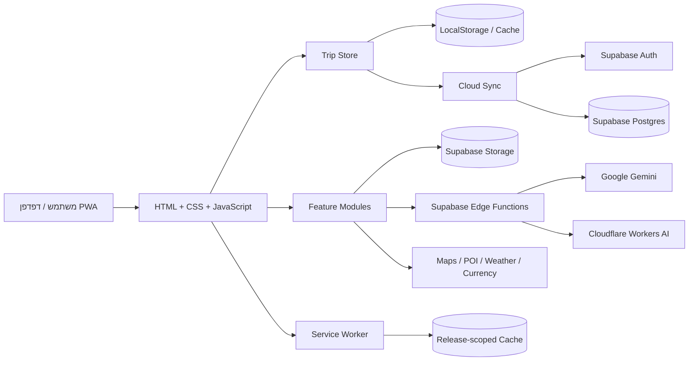
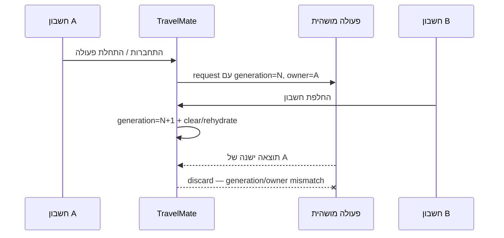
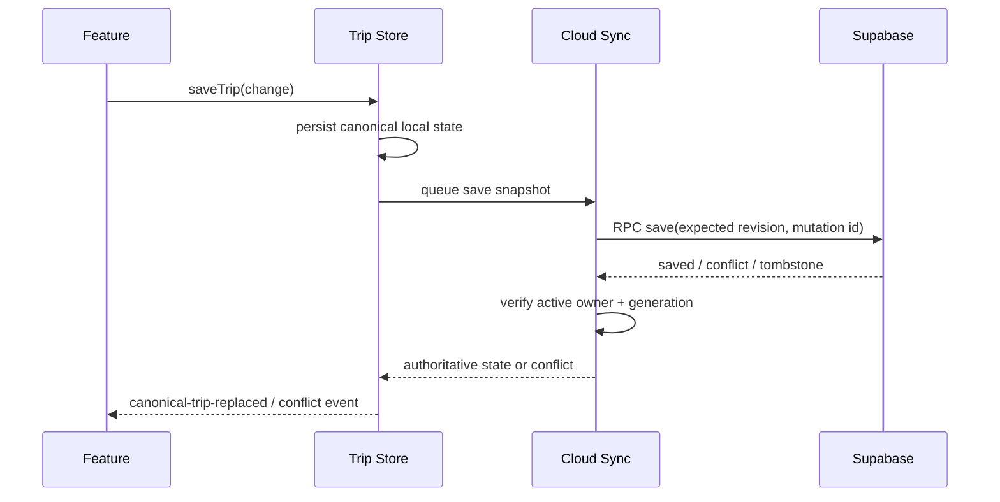
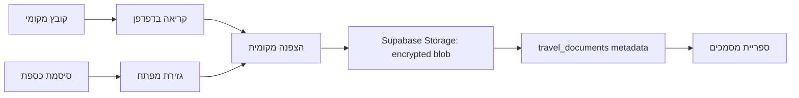
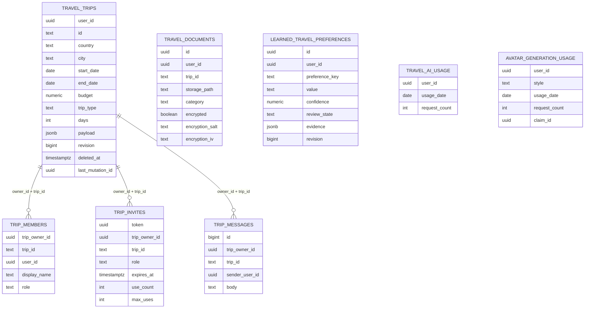

# TravelMate — אפיון ועיצוב טכני

**גרסה מתועדת:** 2.20.3
**Asset version:** `20261007-01`
**ענף פיתוח קנוני:** `preview`
**עודכן:** 7 באוקטובר 2026

## 1. מטרת המערכת

TravelMate היא אפליקציית PWA לניהול מחזור החיים של טיול: יצירה, תכנון, מקומות, תקציב, מסמכים מוצפנים, מזג אוויר, שיתוף, סיוע חכם, סיכום ו־Replay. המערכת תוכננה כ־offline-capable, mobile-first, RTL-first, עם הפרדה בין חשבונות משתמש ועם מקור נתונים קנוני לכל טיול.

## 2. תחום המערכת וגבולות

### בתוך המערכת
- מסכי All Trips וטיול פעיל.
- Overview / Today / Smart Trip.
- Plan, פעילויות, זמני מעבר ומצב תכנון גמיש.
- Places, מקומות שמורים, Nearby ו־Mini Route.
- Budget, הוצאות, מטבעות ותקציב בלתי מוגבל.
- Documents Vault עם הצפנה בצד הלקוח.
- Weather.
- Mate, Traveler Profile 2.0 והעדפות נלמדות באישור.
- Collaboration, הזמנות, חברים וצ'אט.
- Trip Analytics, Summary ו־Replay.
- Offline cache, local recovery ו־cloud synchronization.

### מחוץ למערכת
- שירותי מפות/POI/ויקיפדיה.
- שירותי מזג אוויר ומטבע.
- Supabase Auth/Postgres/Storage/Edge Functions.
- Google Gemini דרך Edge Function בלבד.
- Cloudflare Workers AI ליצירת אווטרים דרך Edge Function בלבד.

## 3. ארכיטקטורה לוגית



היישום הוא Static PWA ללא bundler. הקוד נטען מדפי HTML ומודולי JavaScript עצמאיים. `Trip Store` הוא שכבת הכתיבה המקומית הקנונית, ו־`Cloud Sync` אחראי על הידרציה, סנכרון, Realtime, revision conflicts ו־account isolation.

## 4. שכבות עיקריות

| שכבה | רכיבים מרכזיים | אחריות |
|---|---|---|
| Shell/PWA | `index.html`, `sw.js`, `assets/app.js` | bootstrap, cache, כניסה למסכים |
| Data Core | `trip-store.js`, `cloud-sync.js`, `event-contracts.js` | state קנוני, sync, events |
| Navigation | `trip-redesign.js`, `navigation-memory.js` | ניווט, Back policy, lazy views |
| Trip UX | `trip-experience.js`, `today-activities.js`, `today-brief.js` | Overview, Budget/Memories, Today |
| Planning | `auto-planner.js`, `smart-plan-tools.js`, `free-time-finder.js` | Plan, חלונות זמן, travel time |
| Places | `nearby.js`, `place-auto-fill.js`, `live-routing.js`, `opening-hours.js` | POI, Nearby, route feasibility |
| Intelligence | `ai-assistant.js`, `trip-intelligence.js`, `smart-trip-mode.js` | Mate, advisory intelligence |
| Profile | `user-profile.js`, `profile-wizard.js`, `learned-profile*.js` | explicit + approved learned prefs |
| Documents | `document-vault.js` | client-side encryption + private storage |
| Collaboration | `collaboration.js` | members, invites, messages |
| Analytics | `trip-analytics.js`, `trip-replay.js` | factual recap and route summary |

## 5. מקור אמת ו־state ownership

1. `GitHub preview` הוא מקור האמת לפיתוח.
2. בזמן ריצה, `TravelMateTripStore` הוא facade קנוני למצב הטיול המקומי.
3. `travel_trips` ב־Supabase מחזיק עמודות קנוניות ו־`payload` מורחב.
4. כל cache מקומי של משתמש מחולק לפי owner/account; אין להסתמך על key גלובלי למידע אישי.
5. Cloud mutations משתמשות ב־revision + mutation id כדי למנוע overwrite שקט.
6. מחיקה נשמרת כ־tombstone כדי שמכשיר ישן לא יחזיר טיול שנמחק.

## 6. Account Lifecycle Isolation

בגרסה 2.20.3 נוספה שכבת hardening רוחבית נגד race conditions בזמן A → B → A, sign-out ו־token refresh:

- `authGeneration` ב־Cloud Sync מבטל תוצאות async מהדור הקודם.
- Mate מחזיק `lifecycleGeneration`; session/request ישן לא יכול לכתוב לשיחה של החשבון החדש.
- Trip Intelligence מאפס state ורצפים כאשר owner משתנה.
- Budget/Memories משתמשים ב־owner-partitioned fallback keys ומיגרציה רק אם legacy value תואם במדויק ל־canonical trip של אותו owner.
- Document Vault קושר upload/open/delete ל־`userId + sessionEpoch` של הפעולה המקורית.
- Realtime, full sync, save acknowledgements ו־MFA completion נבדקים מול הדור הפעיל לפני commit ל־UI/state.



## 7. זרימת סנכרון טיול



## 8. Documents Vault — זרימת אבטחה

הקובץ מוצפן בדפדפן לפני העלאה. מפתח ההצפנה נגזר מהסיסמה המקומית; הסיסמה עצמה אינה נשלחת לשרת ואינה נשמרת בענן.



כל פעולה ננעלת ל־initiating account. אם החשבון משתנה באמצע, תוצאת הפעולה אינה מורשית לשנות UI/metadata של החשבון הבא. Cleanup queue מקומי נשמר לפי owner עבור blob שהעלאתו הושלמה אך metadata שלו נכשל.

## 9. Smart Profile / Personal Intelligence

סדר העדיפויות הדטרמיניסטי:

1. החרגות מפורשות של המשתמש.
2. העדפות מפורשות מ־Traveler Profile 2.0.
3. העדפות נלמדות שאושרו ידנית ושעדיין נשענות על evidence תקף.
4. ברירות מחדל ניטרליות.

למידה בין טיולים מופעלת רק ב־opt-in. Evidence נבנה מרשומות מובנות של טיולים שהסתיימו ובבעלות המשתמש; תוכן פרטי של מסמכים/הערות אינו משמש כמקור למידה. Smart Trip ו־Today Brief הם advisory בלבד ואינם משנים itinerary אוטומטית.

## 10. ERD — בסיס הנתונים הקנוני



הערה: `travel_documents` מקושר לוגית ל־trip/user ומוגן ב־RLS; פרופיל מפורש נשמר ב־Supabase Auth user metadata ולא בטבלת פרופיל מקבילה.

## 11. טבלאות מערכת נוספות

- `app_admins` — הרשאות מנהל.
- `app_settings` — הגדרות אפליקטיביות.
- `admin_audit_log` — Audit trail לפעולות מנהל.
- `travel_ai_usage` — מכסת שימוש ב־Mate.
- `avatar_generation_usage` — quota/lease ליצירת אווטרים.
- `learned_travel_preferences` — הצעות למידה, review state, evidence ו־revision.

## 12. Edge Functions

| Function | מטרה | סודות נשארים בצד שרת |
|---|---|---|
| `travel-assistant` | תיווך ל־Gemini, sanitize context, usage controls | Gemini/API config |
| `avatar-generator` | יצירת avatar דרך Cloudflare AI | Cloudflare token/account |
| `admin-center` | פעולות אדמין מוגנות | service role |

## 13. אבטחה ופרטיות

- RLS מופעל על מידע פרטי.
- פעולות collaboration רגישות משתמשות ב־RPC ולא בכתיבה ישירה של client לטבלאות חברות.
- MFA נבדק בפעולות מוגנות כאשר המשתמש נרשם ל־MFA.
- מסמכים מוצפנים לפני Storage upload.
- Mate מקבל context מצומצם ומובנה בלבד; תוכן כספת, סיסמאות, קבלות ו־GPS אינם נשלחים כחלק מ־Mate context הרגיל.
- Account lifecycle fences מונעים תוצאות async של משתמש קודם.
- Avatar provider secrets ו־AI provider secrets אינם נשלחים לדפדפן.

## 14. Offline / PWA

- Service Worker משתמש ב־release-scoped cache: `CACHE_SCHEMA + ASSET_VERSION`.
- startup essentials מוקדמים; features כבדים נטענים lazy/runtime cache.
- ניווט online הוא network-first; ניווט שכבר ביקרנו בו יכול להיפתח offline מה־cache.
- query string אינו מונע fallback של navigation; assets versioned נשמרים לפי URL מדויק.
- local canonical state מוצג לפני cloud hydration, ואז מתבצעת reconciliation.

## 15. Back / Navigation Policy

- חמשת האזורים הראשיים בטיול: Overview, Plan, Places, Budget, Documents.
- Back מתוך subview חוזר למצב הקודם בתוך הטיול.
- Overlay/Modal נסגר לפני יציאה מהמסך.
- יציאה מ־Overview ל־All Trips נעשית דרך חץ היציאה הייעודי; אין ערבוב בין browser history לבין owner פנימי של view state.

## 16. בדיקות ו־Release Gate

לגרסה 2.20.3 אומתו:
- 746/746 Node regression tests.
- 13/13 Playwright account/document lifecycle E2E.
- 5/5 local mobile RC smoke: 390/430, light/dark, reduced-motion, custom trip shell.
- GitHub Actions Verify + Deploy PASS.
- Live GitHub Pages: 390/430 light/dark, RTL, no horizontal overflow, no page errors, asset `20261007-01`.
- Live offline reload PASS לאחר Service Worker activation.
- `git diff --check` PASS, version synchronization PASS, secret-value heuristic PASS.

## 17. תהליך גרסה

```text
sync gate
  -> change in preview
  -> focused tests
  -> full regression
  -> runtime / E2E
  -> version bump when cached assets changed
  -> diff + secrets gate
  -> commit
  -> push preview
  -> GitHub Actions verify/deploy
  -> live smoke
  -> production/main only after explicit approval
```

## 18. סיכונים/חוב טכני ידוע

1. Cleanup של encrypted document blob לאחר metadata deletion מבוסס כיום גם על owner-scoped local retry queue. אם דפדפן נסגר בדיוק בחלון הכשל, ייתכן orphan encrypted blob עד טיפול שרתי עתידי. פתרון עתידי: durable server cleanup journal/worker.
2. Supabase Auth leaked-password protection אינו מופעל כרגע; מומלץ לשקול הפעלה לפני Production לאחר בדיקת UX והשלכות על משתמשים קיימים.
3. ספקי Weather/Maps/Currency חיצוניים עלולים להיכשל זמנית; המערכת צריכה להמשיך להציג shell/state מקומי ולא להגדיר כשל ספק ככשל של הטיול עצמו.
4. אין לבצע merge ל־`main` ללא Release approval מפורש.
