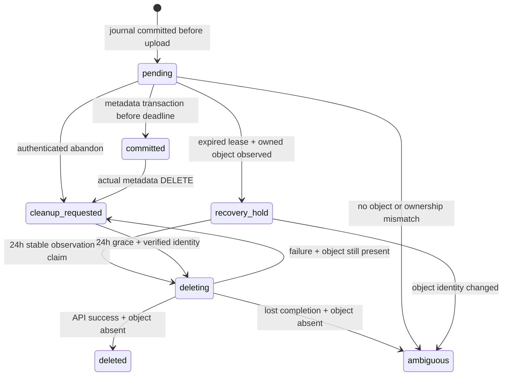

# Document lifecycle recovery

This worker is **not deployed or enabled by this PR**. It uses only opaque
operation/owner/object identifiers and Storage metadata. It never downloads,
decrypts, inspects or logs file contents, passphrases, salt/IV or document names.

## Why the journal closes process-loss recovery

`begin_document_upload(trip_id, expected_owner)` records a private, owner-bound operation and
server-generated Storage path before the browser starts upload. The browser
cannot choose another owner/path. Every new private Storage write requires a live
operation, including requests from old cached clients. A lost begin response
cannot start an unjournaled upload. Existing legacy documents remain readable and
their metadata editable; their paths/owners cannot be changed.
`expected_owner` is a consistency guard, never an authorization source: it must
match the verified `auth.uid()`. An A request acquiring B credentials is rejected
before even creating a B journal. The server still assigns the actual owner/path.
Metadata insertion locks the same journal and commits its state in the database
transaction. Metadata DELETE records cleanup intent in that transaction, including
future explicit deletion of legacy referenced documents. Nothing is backfilled.



| Classification | Recovery behavior |
| --- | --- |
| Referenced | Any metadata reference protects the object, even an unexpected reference. |
| New/in-flight | Live 24h lease; reconciliation cannot claim it. |
| Process lost after upload | First post-expiry observation freezes commits/writes; wait another 24h. |
| Known cleanup failure | Durable intent, stable identity, bounded exponential retry. |
| Ambiguous | Retain journal for manual review; no automatic deletion. |
| Reclaimable | Journal provenance, closed commit window, grace elapsed, exact object ID/version, correct owner, no reference, current claim. |
| Unjournaled orphan | Excluded, including the four existing production orphans. |

Recovery adds **restrictive** Storage write fences; existing ownership and MFA
policies remain unchanged. Row locks serialize Storage writes, metadata commits
and recovery. Once held/claimed, late metadata commits and path replacements are
rejected. Deleted journal tombstones remain to prevent path reuse. Object identity
or timestamp changes quarantine an operation rather than authorize deletion.

The worker accepts a dedicated scheduler bearer secret of at least 32 characters,
not a user JWT. `verify_jwt=false` applies only to this internal endpoint; its
handler enforces the secret and the explicit enable flag. All worker RPCs are
service-role-only, independently checked in the database. Public user RPCs check
`auth.uid()`, user existence and the existing MFA predicate. Private tables grant
no client/service direct access. Definer functions have empty fixed search paths
and explicit execute grants. The privileged service key stays on the server.

The Storage API performs physical deletion. SQL never deletes or updates Storage
rows. Claim tokens, a ten-minute lease, reauthorization before deletion and retained
retry state make overlapping/repeated worker calls safe. A failed/lost remove
response with missing Storage metadata remains ambiguous instead of claiming that
provider deletion definitely completed. References are rechecked at claim,
authorization and completion. The worker returns aggregate counts only.

## Verification

Run `node --test tests/*.test.js`, then:

```sh
npm ci --prefix tools/document-recovery --ignore-scripts
npm test --prefix tools/document-recovery
deno check --config supabase/functions/document-recovery/deno.json supabase/functions/document-recovery/index.ts
```

The pinned PGlite harness executes the actual migration, original document RLS and
MFA policies with synthetic accounts/objects. It is not a mock of the SQL state
machine. Storage object insert/delete statements in this test harness model API
outcomes in its isolated in-memory database, never production. PGlite does not
validate hosted Storage provider behavior or multi-connection lock contention.
Browser tests use real encryption and synthetic Supabase responses. Existing
cleanup/reference coverage moved to database/worker tests because the browser
no longer owns physical deletion.

## Separate rollout, after isolated hosted/local-stack verification

1. Apply the migration in an isolated Supabase stack. Verify actual Storage upload,
   metadata commit/delete, auth/MFA denial, claim concurrency and provider errors.
2. Review schema/policy diff. No existing Storage objects should be adopted.
3. Coordinate a later authorized rollout: migration first, deploy `document-recovery`
   with the committed config/lockfile, configure a dedicated random secret, then
   enable `DOCUMENT_RECOVERY_ENABLED=true`. Never place the service key in cron.
4. Supply Vault secrets `document_recovery_url` and `document_recovery_secret` and
   explicitly run `supabase/document-recovery-schedule.sql` for an hourly job.
   The activation script is not a migration and is not run by CI or deployments.
5. Publish the client only after RPC availability is confirmed. It deliberately
   fails closed if the migration is unavailable; there is no legacy upload fallback.
   Old cached clients are denied new unjournaled writes and must refresh. Coordinate
   the transition to avoid leaving users with an unsupported upload protocol.
6. Monitor aggregate worker results plus private journal state/attempt counts.
   Alert on ambiguous entries/backlog; do not delete them automatically. Disabling
   the worker preserves durable state for later retries. Do not roll back the write
   fence while claims are live. Retain tombstones unless reuse protection is replaced.

No cron extensions/jobs/secrets are installed by the migration. The existing
function deploy workflow and AI learning behavior are unchanged. The new worker
must be deployed explicitly. Pending recovery can continue without users returning,
provided the scheduler/worker are enabled and healthy. Legacy local cleanup queues
remain untouched for forensic review and are never automatically adopted.
